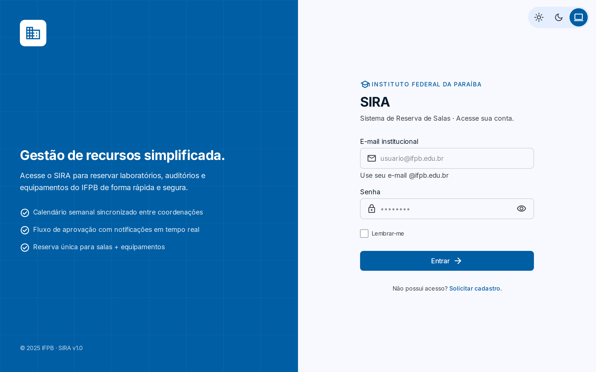

# SIRA — Sistema de Reserva de Salas e Equipamentos

Aplicação web para gerenciar reservas de salas e equipamentos, desenvolvida
como projeto integrado das disciplinas:

- **PWEB2 — Programação para Web 2** (implementação da aplicação)
- **Engenharia de Requisitos de Software** (levantamento, especificação e
  validação dos requisitos)

> **Status:** ✅ **em produção na Vercel** → **<https://sira-jet.vercel.app>**
>
> **Sprint 1** (25/25 user stories) foi um protótipo em **JavaScript puro (ES
> Modules) + Vite**, preservado em [`legacy/`](legacy/) para histórico. A
> **Sprint 2** (fase atual) migrou o produto para **Next.js (App Router) +
> TypeScript + Supabase** e adicionou: **2FA (TOTP)** com **exigência no acesso
> (AAL2)**, **imagem de recurso**, **reserva temporária (hold)**, calendário/
> aprovações/notificações revisados e **responsividade** desktop/tablet/celular.

🔗 **Aplicação:** <https://sira-jet.vercel.app> · 📸 prévia da tela de login:



---

## 📦 Stack

| Camada                  | Ferramenta                                                                                                                                                                                                          | Versão                              |
| ----------------------- | ------------------------------------------------------------------------------------------------------------------------------------------------------------------------------------------------------------------- | ----------------------------------- |
| Framework / dev server  | [Next.js](https://nextjs.org/) (App Router, Server Components, Server Actions)                                                                                                                                      | `16.x`                              |
| Linguagem               | [TypeScript](https://www.typescriptlang.org/) (`strict`)                                                                                                                                                            | `^5`                                |
| UI                      | [React](https://react.dev/)                                                                                                                                                                                         | `19.x`                              |
| Estilo                  | [Tailwind CSS v4](https://tailwindcss.com/) + Material Design 3 (tokens)                                                                                                                                            | `^4`                                |
| Componentes             | [shadcn/ui](https://ui.shadcn.com/) (primitivos [Radix](https://www.radix-ui.com/)) + `next-themes`                                                                                                                 | —                                   |
| Backend / Auth / DB     | [Supabase](https://supabase.com/) (Postgres + Auth + RLS + RPCs + Storage)                                                                                                                                          | `@supabase/ssr ^0.12` · `js ^2.108` |
| Formulários / Validação | [React Hook Form](https://react-hook-form.com/) + [Zod](https://zod.dev/)                                                                                                                                           | `^7` / `^4`                         |
| Gerência de estado      | [TanStack Query](https://tanstack.com/query) (servidor) + [Zustand](https://zustand.docs.pmnd.rs/) (UI global) + Context API                                                                                        | `^5` / `^5`                         |
| Testes                  | `node:test` (unit) · [Vitest](https://vitest.dev/) + [Testing Library](https://testing-library.com/) (componente) · [Cucumber](https://cucumber.io/) (BDD pt-BR) · [Playwright](https://playwright.dev/) (E2E/a11y) | —                                   |
| Qualidade               | [ESLint](https://eslint.org/) + [Prettier](https://prettier.io/) + [Husky](https://typicode.github.io/husky/) + lint-staged                                                                                         | `^9` / `^3`                         |
| Deploy                  | [Vercel](https://vercel.com/)                                                                                                                                                                                       | —                                   |

---

## ✅ Pré-requisitos

- **Node.js 22/24 LTS** — fixado em [`.nvmrc`](.nvmrc). (Na Vercel, use 22.x se a 24 ainda não estiver disponível.)
- **npm 11+** (já vem bundled com o Node).
- Uma conta/projeto **Supabase** (Postgres + Auth + Storage).
- Recomendado: [`nvm`](https://github.com/nvm-sh/nvm) para alternar versões.

```bash
nvm install        # instala a versão do .nvmrc
nvm use            # ativa a versão correta
```

---

## 🚀 Como rodar localmente

```bash
# 1. Instale as dependências (cria node_modules/ e configura o Husky)
npm install

# 2. Configure as variáveis de ambiente (copie o modelo e preencha)
cp .env.example .env.local
#    Preencha NEXT_PUBLIC_SUPABASE_URL, NEXT_PUBLIC_SUPABASE_ANON_KEY,
#    SUPABASE_SERVICE_ROLE_KEY e NEXT_PUBLIC_SITE_URL (ver .env.example).

# 3. Suba o dev server (Next.js + Turbopack, HMR)
npm run dev
```

A aplicação estará disponível em **http://localhost:3000**.

> O script `prepare` do `package.json` roda `husky` automaticamente após o
> `npm install`, registrando os hooks de pre-commit.
> O `SUPABASE_SERVICE_ROLE_KEY` é **server-only** (provisionamento de contas) —
> nunca prefixe com `NEXT_PUBLIC_` nem comite (já está no `.gitignore`).

---

## 🛠️ Scripts disponíveis

| Script                   | O que faz                                                                      |
| ------------------------ | ------------------------------------------------------------------------------ |
| `npm run dev`            | Inicia o servidor de desenvolvimento do Next.js (Turbopack, HMR) na porta 3000 |
| `npm run build`          | Gera o build de produção (`.next/`)                                            |
| `npm run start`          | Serve o build de produção localmente                                           |
| `npm test`               | Roda unit + componente + BDD em sequência                                      |
| `npm run test:unit`      | Testes unitários da lógica pura (`src/lib/`) com `node:test`                   |
| `npm run test:component` | Testes de componente React com **Vitest + Testing Library**                    |
| `npm run test:bdd`       | Cenários **BDD** (Gherkin pt-BR) com **Cucumber**                              |
| `npm run test:e2e`       | Testes **E2E** com **Playwright**                                              |
| `npm run test:a11y`      | Auditoria de **acessibilidade** (Playwright + `@axe-core/playwright`)          |
| `npm run lint`           | Roda o ESLint                                                                  |
| `npm run lint:fix`       | ESLint aplicando correções automáticas                                         |
| `npm run format`         | Formata todos os arquivos com Prettier                                         |
| `npm run prepare`        | Instala os hooks do Husky (executado pelo npm após o `install`)                |

---

## 📁 Estrutura do projeto

O projeto tem **duas fases**, ambas preservadas para histórico:

- **Sprint 2 (atual)** — aplicação em **Next.js + TypeScript + Supabase**.
- **Sprint 1 (legado)** — protótipo em **Vanilla JS + Vite**, preservado em
  [`legacy/`](legacy/) (não é mais buildado).

> As **convenções de desenvolvimento** (padrões arquiteturais, gotchas, contrato
> de IA) vivem em [`AGENTS.md`](AGENTS.md).

### Sprint 2 — atual (Next.js + TypeScript + Supabase)

```
.
├── src/
│   ├── app/                                 # App Router (RSC-first)
│   │   ├── layout.tsx · globals.css          # raiz: fontes, ThemeProvider, Providers (TanStack), VLibras; tokens M3
│   │   ├── (auth)/                           # grupo PÚBLICO (sem shell)
│   │   │   ├── login/                        # page.tsx · login-form.tsx · actions.ts
│   │   │   ├── cadastro/                     # auto-serviço de cadastro de professor
│   │   │   └── redefinir-senha/
│   │   ├── verificar-2fa/                    # desafio TOTP no acesso (enforcement AAL2 — F-39)
│   │   └── (app)/                            # grupo PROTEGIDO (shell + RBAC)
│   │       ├── layout.tsx · loading.tsx      # requireProfile() + navegação por perfil; skeleton de rota
│   │       ├── calendario/                   # grade semanal 7d × 12h
│   │       ├── nova-reserva/                 # assistente (wizard) em 4 passos + reserva temporária (hold)
│   │       ├── minhas-reservas/              # lista + [id]/ (detalhe) + edição/cancelamento + CSV
│   │       ├── notificacoes/                 # central de notificações
│   │       ├── painel/                       # KPIs admin (dashboard)
│   │       ├── aprovacoes/                   # fila admin — aprovar/recusar (decide série recorrente)
│   │       ├── salas/ · equipamentos/        # catálogos (consomem _resources/) + imagem de recurso
│   │       ├── usuarios/                     # gestão de usuários + solicitações de cadastro
│   │       ├── configuracoes/                # perfil · preferências · segurança/2FA · notificações · zona de risco
│   │       └── _resources/                   # componentes/actions compartilhados de salas + equipamentos
│   ├── components/
│   │   ├── shell/                            # app-shell · sidebar · header · nav-config · user-menu · theme-toggle · logout
│   │   ├── ui/                               # primitivos shadcn/Radix (button, input, label, form, dropdown-menu)
│   │   └── providers.tsx · theme-provider.tsx · vlibras.tsx
│   ├── lib/                                  # DOMÍNIO PURO (sem framework, testável com node:test)
│   │   ├── auth.ts · validation.ts · utils.ts · mfa.ts
│   │   ├── reservation.ts · my-reservations.ts · holds.ts · calendar.ts · calendar-events.ts
│   │   ├── approvals.ts · dashboard.ts · notifications.ts · resources.ts · users.ts · preferences.ts
│   │   └── supabase/                         # client · server · admin (service-role) · middleware · database.types
│   ├── schemas/                             # Zod compartilhado client+servidor (auth, profile, reservation, resource, user)
│   ├── hooks/                               # use-media-query · use-mounted · queries/ (TanStack Query)
│   ├── stores/                              # Zustand — ui-store (colapso da sidebar, persistido)
│   └── proxy.ts                             # middleware Next 16 — refresh de sessão + proteção de rota + gate AAL2
├── supabase/migrations/                     # DDL versionada (idempotente, nunca reeditada)
│   ├── 0001_initial_schema · 0002_harden_security_definer_grants · 0003_seed_reference_data
│   ├── 0004_availability_functions · 0005_reservation_submitted_event_trigger
│   └── 0006_reservation_count_aggregation_rpcs · 0007_resource_image_storage · 0008_reservation_holds
├── tests/
│   ├── *.test.ts                            # unitário (node:test) — regras puras de src/lib (+ loader.mjs, tsconfig.json)
│   ├── components/                          # componente — Vitest + Testing Library
│   ├── features/                            # BDD Cucumber (pt-BR): *.feature + steps/ + support/ (World em memória)
│   └── e2e/                                 # Playwright — smoke, a11y, perf, image-upload, hold
├── docs/                                    # espinha de rastreabilidade (o "porquê/o quê/como")
│   ├── requirements/                        # RF-* / RNF-*
│   ├── backlog/                             # epics/ · features/ · sprints/ · glossario.md
│   ├── specs/                               # análise/projeto navegável por feature
│   ├── planning/adrs/                       # ADR-001 … ADR-010 (decisões arquiteturais)
│   └── runbooks/ · mockups/ · reports/
├── public/screenshots/                      # capturas (login.png)
├── legacy/vite-app/                         # Sprint 1 (histórico — não buildado)
├── PRD.md · AGENTS.md (↔ CLAUDE.md symlink) # produto + contrato de desenvolvimento (humano/IA)
├── .env.example                             # contrato de variáveis (Supabase + NEXT_PUBLIC_SITE_URL)
└── next.config.ts · tsconfig.json · eslint.config.mjs · postcss.config.mjs
    · vitest.config.ts · vitest.setup.ts · playwright.config.ts · cucumber.cjs
```

### Sprint 1 — legado (Vanilla JS + Vite) · _histórico_

> Entrega original (25/25 user stories), preservada para referência em
> [`legacy/`](legacy/) — não é mais buildada. A árvore abaixo descreve o layout
> daquela fase.

```
legacy/  (era a raiz do projeto na Sprint 1)
├── .github/workflows/
│   ├── ci.yml             # Valida formatação e build em PRs e push em develop
│   └── deploy.yml         # Publicava no GitHub Pages quando uma release era publicada
├── public/
│   ├── icons/             # Ícones SVG usados pela aplicação
│   └── screenshots/       # Capturas de tela do produto
├── src/
│   ├── components/
│   │   ├── modal.js       # API de modais (createModal/openModal/closeModal) + listener global Esc
│   │   └── sidebar.js     # Sidebar contextual com badges, userPill, logout e toggle de tema
│   ├── data/
│   │   ├── logins.json    # Seed do usuário admin
│   │   ├── seed.json      # Seeds vazios para rooms / reservations / notifications / approvals
│   │   └── store.js       # Camada de dados: AUTH + persistência por usuário + aprovações cross-user
│   ├── modules/
│   │   ├── calendar.js    # Grade semanal 7d × 12h com eventos por status (US-13)
│   │   └── novaReserva.js # Busca de salas + criação de reserva com anti-conflito (US-14/15)
│   ├── utils/
│   │   ├── dom.js         # Factories: el, render, btn, badge, tableRow, toast, confirm
│   │   └── fp.js          # Helpers funcionais: filterByText, computeStats (reduce), initials, statusBadge…
│   ├── main.js            # Entry point — bootstrap, autenticação inline, roteador e drawer mobile
│   └── *.css              # auth.css, home.css, style.css (CSS Variables + dark mode)
├── index.html             # Entry point HTML do Vite
└── vite.config.js         # Configuração do Vite (base condicional via env GITHUB_PAGES)
```

> **Notas de domínio (Sprint 1):**
>
> - `src/components/` continha os blocos visuais reutilizáveis (sidebar, modal).
> - `src/modules/` tinha uma página por arquivo — cada `renderX` era registrado em
>   `PAGE_RENDERERS` no `main.js` e roteado por URL via `pushState` + `popstate`.
> - `src/data/store.js` era a única fonte de verdade para LocalStorage, com
>   particionamento por e-mail (`sira_db/<email>/<colecao>.json`) e consolidação
>   automática quando o usuário logado era admin. _(Substituído por Supabase +
>   RLS na Sprint 2 — ver [ADR-001](docs/planning/adrs/ADR-001-schema-inicial-e-rls-supabase.md).)_

---

## 🔄 Pipeline de qualidade

O fluxo de qualidade funciona assim:

1. **Antes do commit (local):** o hook `pre-commit` do Husky chama
   `npx lint-staged`, que roda ESLint + Prettier **apenas nos arquivos
   alterados** — segundo a configuração `lint-staged` do `package.json`:
   - `*.{ts,tsx,js,jsx}` → `eslint --fix` + `prettier --write`
   - `*.{json,css,md}` → `prettier --write`
2. **Build:** `npm run build` (Next.js) valida tipos (`strict`) e compila as rotas.
3. **Testes:** `npm test` (unitário + componente + BDD) e Playwright (`test:e2e` / `test:a11y`).

> No CI (GitHub Actions), o workflow [`ci.yml`](.github/workflows/ci.yml) roda
> em cada PR: **lint + prettier + build + `npm test`**. O antigo `deploy.yml`
> (GitHub Pages, era Sprint 1) foi removido — na **Sprint 2** o deploy de
> produção é **nativo da Vercel** (ver a seção [Deploy](#-deploy)).

---

## 🚢 Deploy

**Produção:** <https://sira-jet.vercel.app>

O deploy é na **Vercel** (Next.js), conectada ao repositório GitHub: cada push
na branch **`main`** dispara o build de produção e cada PR gera um preview. O
passo a passo completo — variáveis de ambiente, URLs de autenticação do Supabase
e SMTP — está no runbook:

➡️ **[`docs/runbooks/deploy-vercel.md`](docs/runbooks/deploy-vercel.md)**

Variáveis necessárias (Project Settings → Environment Variables):
`NEXT_PUBLIC_SUPABASE_URL`, `NEXT_PUBLIC_SUPABASE_ANON_KEY`,
`SUPABASE_SERVICE_ROLE_KEY` (secreta, server-only) e `NEXT_PUBLIC_SITE_URL`.
Modelo em [`.env.example`](.env.example).

> Headers de segurança (X-Frame-Options, nosniff, Referrer-Policy,
> Permissions-Policy) já vêm configurados em `next.config.ts`.

---

## 🌳 Fluxo de Git

Modelo simplificado, com proteções na `main`:

| Branch      | Papel                                                                                |
| ----------- | ------------------------------------------------------------------------------------ |
| `main`      | Branch protegida. Recebe **apenas** merges via PR de `develop`. Origem das releases. |
| `develop`   | Branch de integração contínua. CI roda em todo push.                                 |
| `feature/*` | Branches de desenvolvimento. Saem de `develop` e voltam via PR para `develop`.       |

**Convenção de commits:** mensagens curtas em português, com prefixos
estilo Conventional Commits — `feat`, `fix`, `chore`, `ci`, `docs`,
`refactor`, `test`.

---

## 🗺️ Roadmap da entrega

O backlog do SIRA foi quebrado em **25 user stories** distribuídas em
**13 épicos** e divididas entre os 5 membros do time. A sequência de
implementação está descrita em [`docs/reports/sprint-1/sequencia_us.pdf`](docs/reports/sprint-1/sequencia_us.pdf)
(quem desbloqueia quem). O detalhamento individual de cada membro está
em [`docs/team-tasks/sprint-1/`](docs/team-tasks/sprint-1/).

### Bloco 1 — Fundação, Autenticação e Tema · _Gabriel Marques_

| US    | Descrição                                | Status      | PR                                                                                                                                                                                                      |
| ----- | ---------------------------------------- | ----------- | ------------------------------------------------------------------------------------------------------------------------------------------------------------------------------------------------------- |
| US-01 | Configurar projeto base com Vite         | ✅ Mergeada | [#125](https://github.com/GabeMarques-Intetsu/SIRA/pull/125)                                                                                                                                            |
| US-02 | Criar utilitários funcionais e estilos   | ✅ Mergeada | [#126](https://github.com/GabeMarques-Intetsu/SIRA/pull/126)                                                                                                                                            |
| US-03 | Permitir login pelo e-mail institucional | ✅ Mergeada | [#127](https://github.com/GabeMarques-Intetsu/SIRA/pull/127)                                                                                                                                            |
| US-04 | Permitir solicitação de cadastro         | ✅ Mergeada | [#128](https://github.com/GabeMarques-Intetsu/SIRA/pull/128)                                                                                                                                            |
| US-05 | Permitir logout do sistema               | ✅ Mergeada | [#127](https://github.com/GabeMarques-Intetsu/SIRA/pull/127) (T-05.2 — `logout()` em `store.js`) · [#134](https://github.com/GabeMarques-Intetsu/SIRA/pull/134) (T-05.1 — botão "Sair" no `userPill`)   |
| US-09 | Alternar tema claro/escuro               | ✅ Mergeada | [#134](https://github.com/GabeMarques-Intetsu/SIRA/pull/134) (T-09.1/T-09.2 — toggle + persistência) · [#154](https://github.com/GabeMarques-Intetsu/SIRA/pull/154) (T-09.3 — restauração no bootstrap) |

**Conclusão:** 6 / 6 user stories concluídas.

### Bloco 2 — Shell, Navegação, Mobile, Modais e Calendário · _Ian Lucas_

| US    | Descrição                                          | Status      | PR                                                           |
| ----- | -------------------------------------------------- | ----------- | ------------------------------------------------------------ |
| US-06 | Sidebar contextual com badges e filtro por role    | ✅ Mergeada | [#134](https://github.com/GabeMarques-Intetsu/SIRA/pull/134) |
| US-07 | Roteamento por URL com `pushState` + `popstate`    | ✅ Mergeada | [#144](https://github.com/GabeMarques-Intetsu/SIRA/pull/144) |
| US-08 | Drawer mobile com hambúrguer e tabelas responsivas | ✅ Mergeada | [#145](https://github.com/GabeMarques-Intetsu/SIRA/pull/145) |
| US-13 | Calendário semanal 7d × 12h com eventos por status | ✅ Mergeada | [#147](https://github.com/GabeMarques-Intetsu/SIRA/pull/147) |
| US-25 | Sistema centralizado de modais (create/open/close) | ✅ Mergeada | [#149](https://github.com/GabeMarques-Intetsu/SIRA/pull/149) |

**Conclusão:** 5 / 5 user stories concluídas.

### Bloco 3 — Persistência, Dashboard e Notificações · _Igor Gimenez_

| US    | Descrição                                                | Status      | PR                                                           |
| ----- | -------------------------------------------------------- | ----------- | ------------------------------------------------------------ |
| US-10 | LocalStorage isolado por usuário (`sira_db/<email>/...`) | ✅ Mergeada | [#143](https://github.com/GabeMarques-Intetsu/SIRA/pull/143) |
| US-11 | Sincronização aprovação → reserva → notificação          | ✅ Mergeada | [#143](https://github.com/GabeMarques-Intetsu/SIRA/pull/143) |
| US-12 | Dashboard administrativo com KPIs em tempo real          | ✅ Mergeada | [#161](https://github.com/GabeMarques-Intetsu/SIRA/pull/161) |
| US-24 | Caixa de notificações com marcação como lidas            | ✅ Mergeada | [#162](https://github.com/GabeMarques-Intetsu/SIRA/pull/162) |

**Conclusão:** 4 / 4 user stories concluídas.

### Bloco 4 — Nova Reserva e CRUD de Reservas · _José Henrique_

| US    | Descrição                                             | Status      | PR                                                           |
| ----- | ----------------------------------------------------- | ----------- | ------------------------------------------------------------ |
| US-14 | Busca de salas com filtros e anti-conflito de horário | ✅ Mergeada | [#152](https://github.com/GabeMarques-Intetsu/SIRA/pull/152) |
| US-15 | Detalhes da sala + reserva 1-clique com aprovação     | ✅ Mergeada | [#152](https://github.com/GabeMarques-Intetsu/SIRA/pull/152) |
| US-16 | Listar minhas reservas com filtros e busca textual    | ✅ Mergeada | [#159](https://github.com/GabeMarques-Intetsu/SIRA/pull/159) |
| US-17 | Ver, editar e cancelar reservas pendentes             | ✅ Mergeada | [#159](https://github.com/GabeMarques-Intetsu/SIRA/pull/159) |
| US-18 | Exportar reservas em CSV                              | ✅ Mergeada | [#159](https://github.com/GabeMarques-Intetsu/SIRA/pull/159) |

**Conclusão:** 5 / 5 user stories concluídas.

### Bloco 5 — Administração (Aprovações, Salas e Usuários) · _Pedro Sales_

| US    | Descrição                                           | Status      | PR                                                           |
| ----- | --------------------------------------------------- | ----------- | ------------------------------------------------------------ |
| US-19 | Fila consolidada de aprovações pendentes            | ✅ Mergeada | [#163](https://github.com/GabeMarques-Intetsu/SIRA/pull/163) |
| US-20 | Aprovar / recusar reservas com notificação ao autor | ✅ Mergeada | [#163](https://github.com/GabeMarques-Intetsu/SIRA/pull/163) |
| US-21 | CRUD de salas com filtros, recursos e status        | ✅ Mergeada | [#164](https://github.com/GabeMarques-Intetsu/SIRA/pull/164) |
| US-22 | CRUD de usuários com perfis professor/admin         | ✅ Mergeada | [#170](https://github.com/GabeMarques-Intetsu/SIRA/pull/170) |
| US-23 | Aprovar/recusar solicitações de cadastro pendentes  | ✅ Mergeada | [#166](https://github.com/GabeMarques-Intetsu/SIRA/pull/166) |

**Conclusão:** 5 / 5 user stories concluídas.

### Resumo geral

| Bloco                       | Responsável     | Concluído | Total  |
| --------------------------- | --------------- | --------- | ------ |
| Fundação + Auth + Tema      | Gabriel Marques | 6         | 6      |
| Shell + Modais + Calendário | Ian Lucas       | 5         | 5      |
| Persistência + Dashboard    | Igor Gimenez    | 4         | 4      |
| Reservas (Nova + CRUD)      | José Henrique   | 5         | 5      |
| Administração               | Pedro Sales     | 5         | 5      |
| **Total**                   | —               | **25**    | **25** |

> ⚠️ A tabela e os blocos acima refletem a **entrega original em Vanilla JS + Vite**.
> O projeto foi **migrado para Next.js + TypeScript + Supabase**; a lista abaixo
> reflete as funcionalidades **atuais**.

**Funcionalidades implementadas (Next.js + Supabase):**

- **Autenticação institucional** (`@ifpb.edu.br`): login, cadastro com aprovação,
  logout, recuperação de senha por e-mail, **MFA/TOTP** opcional; sessão via
  Supabase Auth (verificação local de JWT com `getClaims`).
- **Proteção de rotas por perfil** (professor/admin) via `proxy.ts` + guards no servidor.
- **Calendário semanal** 7d × 12h com eventos por status; **Nova Reserva** (wizard
  com busca anti-conflito e **reserva temporária / _hold_** do recurso durante a solicitação).
- **CRUD das próprias reservas** (listar, filtrar, ver detalhe, editar, cancelar, exportar CSV).
- **Painel administrativo** com KPIs (agregação no banco via RPC).
- **Central de notificações** (marcar individual/todas) com cache via TanStack Query.
- **Fila de aprovações** (aprovar/recusar com motivo → notificação ao solicitante;
  bloqueio de auto-aprovação).
- **Gestão de recursos** — CRUD de **salas e equipamentos**, agora **com upload de imagem**
  (Supabase Storage) exibida nos cards.
- **Gestão de usuários** e revisão de solicitações de cadastro (provisionamento via service-role).
- **Configurações da conta** — perfil, tema (claro/escuro/sistema), densidade,
  reduzir-animações, preferências de notificação, segurança e zona de risco.
- **Acessibilidade** (WCAG 2.2 AA, axe 0 violações), **responsividade** (mobile-first)
  e **VLibras** (tradutor de Libras) em todas as páginas.

---

## 👥 Equipe

| Membro              | GitHub                                                         | Bloco                                         |
| ------------------- | -------------------------------------------------------------- | --------------------------------------------- |
| **Gabriel Marques** | [@GabeMarques-Intetsu](https://github.com/GabeMarques-Intetsu) | Fundação + Autenticação + Tema                |
| **Ian Lucas**       | [@IanGds](https://github.com/IanGds)                           | Shell + Navegação + Modais + Calendário       |
| **Igor Gimenez**    | [@igorgmnzmonte](https://github.com/igorgmnzmonte)             | Persistência + Dashboard + Notificações       |
| **José Henrique**   | [@jhenriquecs](https://github.com/jhenriquecs)                 | Reservas (Nova Reserva + CRUD + CSV)          |
| **Pedro Sales**     | [@pedro-sls](https://github.com/pedro-sls)                     | Administração (Aprovações + Salas + Usuários) |

Projeto acadêmico desenvolvido no IFPB para as disciplinas de
**Programação para Web 2** e **Engenharia de Requisitos de Software**.
