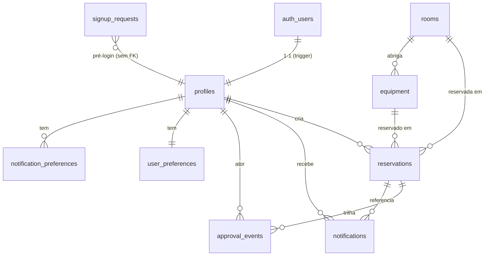

# ADR-001: Adotar schema relacional Postgres/Supabase com RLS por usuário para o SIRA

## Status

Accepted

Primeiro ADR da espinha de planejamento. Fundamenta a migração do protótipo Vite + LocalStorage (`legacy/vite-app/src/data/store.js`) para Next.js + Supabase (Postgres gerenciado), preservando os requisitos de isolamento de dados (RF-003, RNF-seguranca-privacidade).

## Context

O protótipo legado persistia tudo em LocalStorage particionado por e-mail (`sira_db/<email>/<colecao>.json`), com salas em uma chave global e um admin hardcoded (`admin@ifpb.edu.br`). O isolamento entre usuários era feito na camada de aplicação — frágil em PC compartilhado e impossível de auditar.

A migração para Supabase troca essa camada por um Postgres real com autenticação (`auth.users`) e Row-Level Security (RLS). As forças em jogo:

- **Isolamento de dados pessoais** (RF-003, RNF-seguranca-privacidade, alvo: 0 vazamentos entre usuários) precisa ser garantido no banco, não na aplicação. → RLS habilitado em todas as tabelas é mandatório.
- **Dois perfis** (`admin`, `professor`) com poderes assimétricos: professor só enxerga o próprio; admin enxerga/gere tudo (aprovações, catálogos, usuários).
- **Recursos reserváveis de dois tipos** (salas e equipamentos) que compartilham o mesmo fluxo de reserva/aprovação/conflito.
- **Cadastro pré-login** (F-03/F-32/F-33): solicitações de cadastro existem _antes_ de haver `auth.users`, logo não podem depender de `auth.uid()`.

Opções consideradas em três eixos:

### Eixo 1 — Tipagem de domínios fechados (status, role, kind...)

1. **Enums nativos do Postgres** — type-safety no banco, auto-documentado, rejeita valores inválidos sem CHECK extra. Custo: adicionar valor exige `ALTER TYPE ... ADD VALUE` (não roda dentro de transação no PG < 12 para uso imediato; reordenar/remover é caótico).
2. **`text` + `CHECK (... IN (...))`** — flexível, fácil de evoluir com migration. Custo: sem o tipo compartilhado, cada coluna repete o CHECK; menos auto-documentado.

### Eixo 2 — Modelagem de reservas (sala vs equipamento)

1. **Tabela única `reservations` + `resource_kind` + FKs nuláveis** (`room_id`/`equipment_id`) — fluxo de aprovação, conflito, notificação e listagem ficam unificados; uma só policy de RLS; uma só timeline. Custo: exige CHECK garantindo XOR (exatamente um FK preenchido conforme o kind).
2. **Duas tabelas (`room_reservations`, `equipment_reservations`)** — FKs sempre obrigatórias, sem coluna nulável. Custo: duplica todo o ecossistema (aprovação, notificação, conflito, RLS, índices) e complica telas que listam "minhas reservas" agregadas.

### Eixo 3 — Histórico de aprovação

1. **Coluna de status na reserva apenas** — simples, mas perde a trilha (quem submeteu/aprovou/recusou e quando) exigida pelo detalhe da reserva (mockup 12) e por F-21/F-22/F-23.
2. **Status na reserva + tabela-evento `approval_events` (append-only)** — status atual na reserva (consulta rápida) + timeline imutável de eventos para auditoria.

## Decision

Schema **relacional em Postgres (Supabase)**, 3NF, com **RLS habilitado em todas as tabelas** e uma função `SECURITY DEFINER` `public.is_admin()` como predicado central das policies de admin.

- **Eixo 1 → Enums nativos** para domínios estáveis e pequenos (`user_role`, `entity_status`, `room_type`, `resource_kind`, `reservation_status`, `recurrence_type`, `approval_action`, `signup_status`, `theme_pref`, `language_pref`, `density_pref`). O ganho de integridade e auto-documentação supera o custo de evolução, que aqui é raro. `equipment.type` permanece **`text`** (vocabulário aberto: Projetor, Notebook, Microfone, Câmera... cresce com frequência).
- **Eixo 2 → Tabela única `reservations`** com `resource_kind` e CHECK de XOR entre `room_id` e `equipment_id`.
- **Eixo 3 → Status atual na reserva + `approval_events` append-only.**

Entidades (11 tabelas): `profiles`, `rooms`, `equipment`, `reservations`, `approval_events`, `notifications`, `signup_requests`, `user_preferences`, `notification_preferences`. (`auth.users` é do Supabase; `profiles` espelha 1-1 via trigger `on_auth_user_created`.)

### ERD (mermaid)

### Matriz de RLS

| Tabela                     | SELECT                   | INSERT                             | UPDATE                  | DELETE |
| -------------------------- | ------------------------ | ---------------------------------- | ----------------------- | ------ |
| `profiles`                 | dono OU admin            | (trigger; bloqueado a clientes)    | dono OU admin           | admin  |
| `rooms`                    | qualquer autenticado     | admin                              | admin                   | admin  |
| `equipment`                | qualquer autenticado     | admin                              | admin                   | admin  |
| `reservations`             | dono OU admin            | dono (própria)                     | dono OU admin (aprovar) | dono   |
| `approval_events`          | dono da reserva OU admin | admin                              | — (append-only)         | —      |
| `notifications`            | dono                     | dono OU admin (criar p/ alvo)      | dono (marcar lida)      | dono   |
| `signup_requests`          | admin                    | **anon/authenticated** (pré-login) | admin                   | admin  |
| `user_preferences`         | dono                     | dono                               | dono                    | dono   |
| `notification_preferences` | dono                     | dono                               | dono                    | dono   |

A função `public.is_admin()` é `SECURITY DEFINER` e consulta `profiles.role` do `auth.uid()`, evitando recursão de policy na própria `profiles` (a policy de admin em `profiles` chama a função, que lê com privilégio do owner, não reavaliando RLS).

`updated_at` mantido por trigger usando a extensão `moddatetime` nas tabelas mutáveis. `profiles` é criado por trigger `handle_new_user` em `auth.users` (AFTER INSERT), populando `full_name`/`email` a partir de `raw_user_meta_data`.

## Consequences

**Positivas:**

- Isolamento garantido pelo banco: mesmo um bug no front ou uma chamada direta à API REST do Supabase não vaza dados entre usuários (atende RNF-seguranca-privacidade, alvo 0 vazamentos).
- Admin não é mais hardcoded por e-mail — é `profiles.role = 'admin'`, auditável e mutável.
- Detecção de conflito vira um índice + query no banco (sala/equipamento × data × faixa horária), não varredura de coleções em memória.
- Trilha de aprovação imutável (`approval_events`) cobre o detalhe da reserva e a auditoria.
- Tabela única de reservas simplifica telas agregadas, notificações e RLS.

**Negativas / trade-offs aceitos:**

- Enums nativos custam mais para evoluir (`ALTER TYPE ADD VALUE`); aceitável dado que os domínios são estáveis.
- A FK nulável em `reservations` exige um CHECK de XOR para preservar a integridade que duas tabelas dariam de graça.
- `signup_requests` aberta a `anon` para INSERT é uma superfície que precisa de WITH CHECK restritivo (status forçado a `pending`, sem escrita em colunas de decisão) + rate limiting na borda (Edge Function / Turnstile) — fora do escopo deste schema, sinalizado para `cyber-security-architect`.
- Sobreposição de horário: o CHECK garante `start_time < end_time`, mas a _ausência de conflito_ entre reservas aprovadas não é imposta por constraint neste ADR (exigiria `EXCLUDE USING gist` com `btree_gist`). Decisão: validar na aplicação por ora; constraint de exclusão fica como evolução proposta.

## Cross-ref

- Implementação: `supabase/migrations/0001_initial_schema.sql`.
- Requisitos: RF-001, RF-003, RF-006/007, RF-008, RF-009/013, RF-010, RF-011, RF-012; RNF-seguranca-privacidade.
- Modelo legado: `legacy/vite-app/src/data/store.js`.
- Handoff: `cyber-security-architect` (hardening do INSERT anônimo em `signup_requests`, rate limit, 2FA), `backend-architect` (DAL/Server Actions sobre este schema).
