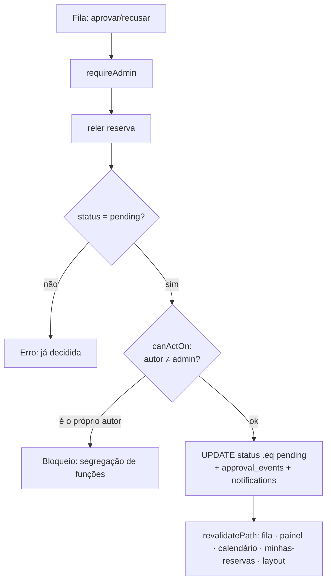

# Spec — Fila de aprovações

> **Rastreabilidade**
>
> - **RF**: [RF-008 — Aprovação e recusa de solicitações de reserva](../requirements/RF/RF-008-aprovacao-e-recusa-de-solicitacoes-de-reserva.md)
> - **Features**: [F-21 Fila consolidada](../backlog/features/F-21-fila-consolidada-de-aprovacoes-pendentes.md) · [F-22 Aprovação](../backlog/features/F-22-aprovacao-de-reserva.md) · [F-23 Recusa](../backlog/features/F-23-recusa-de-reserva.md) · [F-11 Sincronização reserva↔aprovação↔notificação](../backlog/features/F-11-sincronizacao-aprovacao-reserva-notificacao.md)
> - **Código**: `src/app/(app)/aprovacoes/page.tsx` · `approval-actions.tsx` · `approval-filters.tsx` · `actions.ts` · `src/lib/approvals.ts`
> - **Testes**: `tests/features/US21.1-...feature` · `US21.2-filtragem-pesquisa-e-acoes-na-fila.feature` · `US22.1-aprovacao-de-reserva.feature` · `US23.1-recusa-de-reserva.feature` · `US11.1-propagacao-da-decisao-de-reserva.feature`
> - **Mockup**: `docs/mockups/08-aprovacoes.html`

## User Stories

- **US21.1** — Como **administrador**, quero uma fila consolidada de solicitações pendentes ordenada cronologicamente, para decidir na ordem certa.
- **US21.2** — Como **administrador**, quero filtrar e pesquisar na fila e agir nela, para trabalhar grandes volumes.
- **US22.1** — Como **administrador**, quero aprovar uma reserva, para liberar o uso do recurso.
- **US23.1** — Como **administrador**, quero recusar uma reserva (com motivo), para informar o solicitante.
- **US11.1** — Como **solicitante**, quero que a decisão se propague (status + notificação + KPIs), para acompanhar o resultado.

## Critérios de Aceitação

| ID   | Critério                                                                                |
| ---- | --------------------------------------------------------------------------------------- |
| CA01 | Acesso restrito a administradores.                                                      |
| CA02 | A fila lista solicitações **pendentes**, em ordem cronológica.                          |
| CA03 | Aprovar muda o status para aprovada e notifica o solicitante.                           |
| CA04 | A decisão sincroniza fila, painel, calendário e lista pessoal.                          |
| CA05 | Recusar exige/permite motivo (até `REJECT_REASON_MAX`) e notifica.                      |
| CA06 | **Segregação de funções**: o admin **não** pode avaliar a **própria** solicitação.      |
| CA07 | **Idempotência**: uma reserva já decidida não pode ser decidida de novo (anti-corrida). |

> Regras puras em `src/lib/approvals.ts` (`canActOn`, `computeKpis`,
> `applySearch`, `REJECT_REASON_MAX`). A action reautentica (`requireAdmin`),
> relê a reserva exigindo `status = pending`, bloqueia a auto-avaliação
> (`canActOn`), e o UPDATE carrega `.eq("status","pending")` como guarda
> anti-corrida — só a 1ª decisão vence. Após decidir, revalida todas as
> superfícies (`/aprovacoes`, `/`, `/calendario`, `/minhas-reservas`, layout).

## Cenário BDD

```gherkin
# language: pt
Funcionalidade: Aprovação de reserva

  Cenário: Aprovar uma solicitação pendente
    Dado que sou administrador e há uma reserva pendente de outro usuário
    Quando aprovo a reserva
    Então o status passa a aprovada
    E o solicitante recebe uma notificação

  Cenário: Admin não avalia a própria solicitação
    Dado que sou administrador e criei uma reserva pendente
    Quando abro a fila de aprovações
    Então não consigo aprovar nem recusar a minha própria solicitação

  Cenário: Reserva já decidida não é decidida de novo
    Dado que uma reserva foi recém-aprovada em outra aba
    Quando tento aprová-la novamente
    Então o sistema informa que ela já foi decidida
```

## Fluxo


