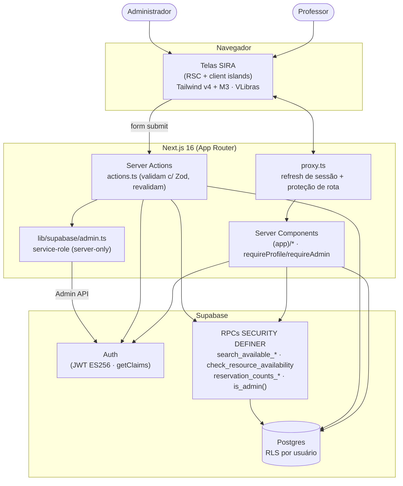
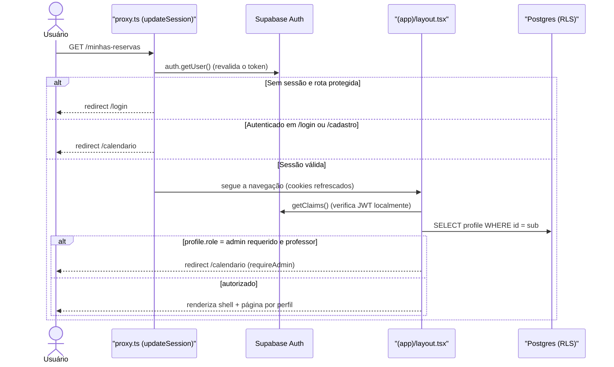
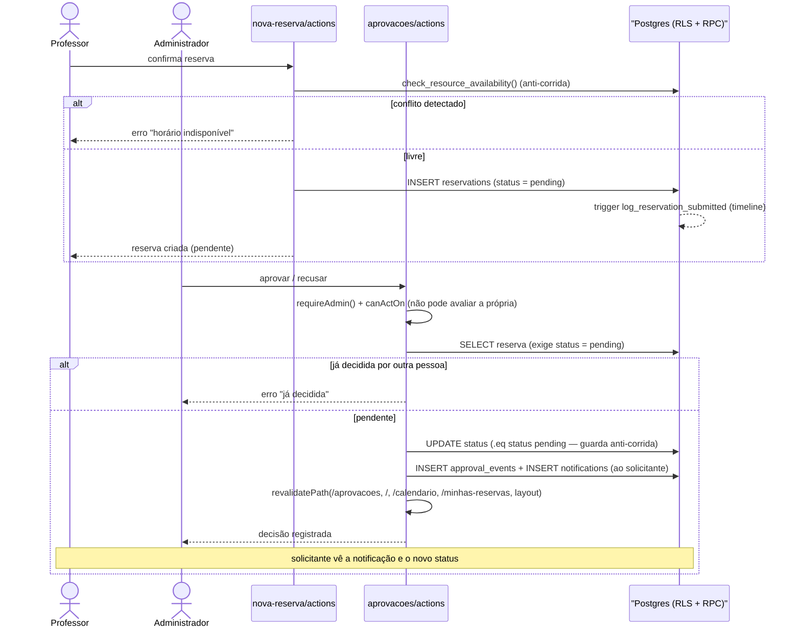
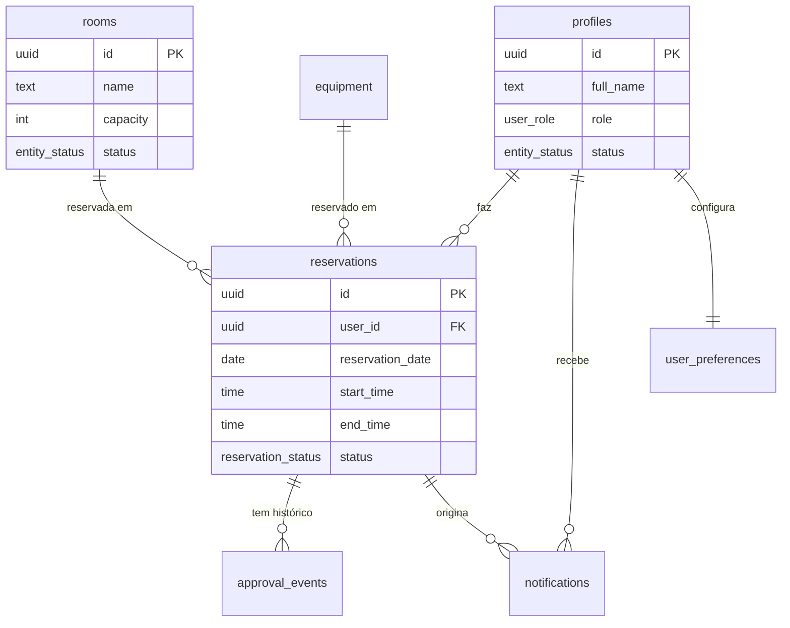

# Arquitetura do SIRA

> Visão de arquitetura do SIRA com diagramas. Detalha como Next.js (App Router),
> Supabase (Postgres + RLS + RPCs) e as camadas de validação/estado se compõem.
> Decisões fundantes: [ADR-001](../planning/adrs/ADR-001-schema-inicial-e-rls-supabase.md)
> (schema + RLS), [ADR-002](../planning/adrs/ADR-002-provisionamento-de-contas-via-service-role.md)
> (service-role), [ADR-003](../planning/adrs/ADR-003-padronizacao-notification-type-e-emissao-em-server-action.md)
> (notificações em Server Action).

## 1. Princípios

- **RSC-first**: páginas são Server Components; interatividade isolada em "client islands".
- **Server Actions** para toda mutação; revalidação por `revalidatePath`.
- **Segurança no banco**: RLS por usuário em todas as tabelas; RPCs `SECURITY DEFINER`
  para o que cruza fronteira de dono (conflito de horário, KPIs).
- **Validação única** Zod client+servidor (`src/schemas/`), com a regra de
  domínio em `src/lib/`.
- **service-role isolada** (`server-only`) só para provisionar contas.

## 2. Contexto e componentes (C4-ish)

**Leitura**: o `proxy` refresca a sessão e barra acesso não autenticado a cada
request. Os Server Components leem dados já filtrados pela RLS (e por RPCs quando
há conflito/KPI). As mutações passam por Server Actions, que revalidam a entrada
com Zod e só então tocam o banco. O provisionamento de contas é o único caminho
que usa a chave service-role, blindada por `server-only`.

## 3. Fluxo de autenticação e proteção de rota

Código: [`src/lib/supabase/middleware.ts`](../../src/lib/supabase/middleware.ts)
(`updateSession`), [`src/proxy.ts`](../../src/proxy.ts),
[`src/lib/auth.ts`](../../src/lib/auth.ts), [`src/app/(app)/layout.tsx`](../../src/app/%28app%29/layout.tsx).
Decisão de tema/sessão sem flash: [ADR-004](../planning/adrs/ADR-004-tema-densidade-reducao-de-movimento-sem-script.md).

> `proxy` usa `getUser()` (revalida no servidor de auth) para **decisões de
> proteção**; os Server Components usam `getClaims()` (verificação **local** do
> JWT, sem round-trip) para ler o usuário a cada navegação, com `cache()` por request.

## 4. Fluxo de aprovação de reserva

Código: [`src/app/(app)/nova-reserva/actions.ts`](../../src/app/%28app%29/nova-reserva/actions.ts),
[`src/app/(app)/aprovacoes/actions.ts`](../../src/app/%28app%29/aprovacoes/actions.ts),
[`src/lib/approvals.ts`](../../src/lib/approvals.ts).
Notificações: [ADR-003](../planning/adrs/ADR-003-padronizacao-notification-type-e-emissao-em-server-action.md).
Sincronização: F-11 (reserva → aprovação → notificação).

**Garantias** (ver `aprovacoes/actions.ts`): reautenticação do papel no servidor;
**segregação de funções** (o admin autor não avalia a própria solicitação);
idempotência por re-leitura `status = pending` + guarda `.eq("status","pending")`
no UPDATE (duplo-clique/duas abas — só a 1ª decisão vence); RLS permite o INSERT
em `approval_events`/`notifications`.

## 5. Modelo de dados (resumo)

Esquema canônico em [`supabase/migrations/0001_initial_schema.sql`](../../supabase/migrations/0001_initial_schema.sql).

> O estado "Concluída" **não** existe no enum `reservation_status` — é derivado
> (reserva aprovada cujo horário já passou). Ver
> [ADR-006](../planning/adrs/ADR-006-status-concluida-ausente-do-enum-reservation-status.md).
