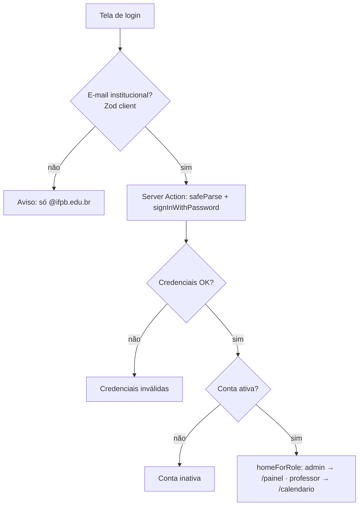

# Spec — Autenticação e sessão

> **Rastreabilidade**
>
> - **RF**: [RF-001 — Acesso institucional e continuidade de sessão](../requirements/RF/RF-001-acesso-institucional-e-continuidade-de-sessao.md)
> - **Features**: [F-01 Login](../backlog/features/F-01-login-institucional-por-e-mail.md) · [F-02 Sessão persistente](../backlog/features/F-02-persistencia-de-sessao-entre-recargas.md) · [F-03 Auto-cadastro de professor](../backlog/features/F-03-auto-servico-de-cadastro-de-professor.md) · [F-04 Logout](../backlog/features/F-04-encerramento-de-sessao-logout.md)
> - **Código**: `src/app/(auth)/login/` · `src/app/(auth)/cadastro/` · `src/app/(auth)/redefinir-senha/` · `src/lib/auth.ts` · `src/lib/supabase/middleware.ts` · `src/proxy.ts` · `src/components/shell/logout-action.ts` · `src/schemas/auth.ts`
> - **Testes**: `tests/features/US01.1-login-institucional.feature` · `US02.1-continuidade-de-sessao.feature` · `US03.1-solicitacao-de-cadastro.feature` · `US04.1-encerramento-de-sessao.feature`
> - **ADRs**: [ADR-002](../planning/adrs/ADR-002-provisionamento-de-contas-via-service-role.md) (provisionamento) · [ADR-010](../planning/adrs/ADR-010-enforcement-de-2fa-no-acesso-aal2.md) (2FA no acesso)

> **Nota — 2FA no acesso (AAL2).** Quando a conta tem verificação em duas etapas
> ativa, o login **não libera o app direto**: `updateSession()` (`src/proxy.ts`)
> detecta `nextLevel = aal2` e redireciona para **`/verificar-2fa`** (desafio
> TOTP) antes de qualquer rota do `(app)`. É o enforcement da
> [F-39 US39.4](../backlog/features/F-39-seguranca-da-conta.md) — regra em
> [RF-012](../requirements/RF/RF-012-configuracoes-da-conta-e-preferencias.md),
> design em [ADR-010](../planning/adrs/ADR-010-enforcement-de-2fa-no-acesso-aal2.md).

## User Stories

- **US01.1** — Como **professor**, quero entrar com meu e-mail institucional e senha, para chegar à tela inicial do meu perfil de forma segura.
- **US02.1** — Como **usuário autenticado**, quero permanecer logado entre recargas e abas, para não reautenticar a cada navegação.
- **US03.1** — Como **professor sem conta**, quero solicitar cadastro com meus dados, para que um admin aprove meu acesso.
- **US04.1** — Como **usuário autenticado**, quero encerrar minha sessão, para proteger minha conta em equipamentos compartilhados.

## Critérios de Aceitação (de F-01)

| ID   | Critério                                                                                          |
| ---- | ------------------------------------------------------------------------------------------------- |
| CA01 | Acesso só com e-mail institucional (`@ifpb.edu.br`) e senha.                                      |
| CA02 | E-mail de outro domínio é rejeitado com aviso.                                                    |
| CA03 | E-mail não cadastrado → mensagem de credenciais inválidas.                                        |
| CA04 | Senha incorreta → mensagem de credenciais inválidas.                                              |
| CA05 | Conta inativa não acessa, mesmo com senha correta (aviso de conta inativa).                       |
| CA06 | E-mail e senha são obrigatórios; envio vazio é bloqueado.                                         |
| CA07 | Acesso bem-sucedido leva à tela inicial do perfil (admin → `/painel`, professor → `/calendario`). |

> A regra de domínio institucional vive em `src/lib/validation.ts`
> (`INSTITUTIONAL_DOMAIN`) e é expressa em Zod por `INSTITUTIONAL_EMAIL_RE`
> em `src/schemas/auth.ts` (mesma fonte, sem duplicar). `homeForRole()` em
> `src/components/shell/nav-config.ts` resolve a tela inicial (CA07).

## Cenários BDD

```gherkin
# language: pt
Funcionalidade: Login institucional

  Cenário: Acesso com credenciais válidas
    Dado que Ana tem uma conta ativa com o e-mail "ana@ifpb.edu.br"
    Quando ela informa o e-mail "ana@ifpb.edu.br" e a senha correta e confirma o acesso
    Então o sistema a leva para a tela inicial do perfil dela

  Cenário: Acesso com e-mail de outro domínio
    Dado que Bruno está na tela de acesso
    Quando ele informa o e-mail "bruno@gmail.com" e uma senha e confirma o acesso
    Então o sistema recusa a entrada
    E exibe um aviso de que somente e-mails institucionais são aceitos

  Cenário: Acesso de conta inativa
    Dado que Ana tem uma conta inativa com o e-mail "ana@ifpb.edu.br"
    Quando ela informa o e-mail "ana@ifpb.edu.br" e a senha correta e confirma o acesso
    Então o sistema recusa a entrada
    E exibe um aviso de que a conta está inativa
```

## Fluxo



> Sessão (US02.1): o `proxy.ts` → `updateSession()` refresca os cookies de auth a
> cada request, mantendo o login entre recargas/abas. Logout (US04.1):
> `logout-action.ts` encerra a sessão e redireciona para `/login`.
