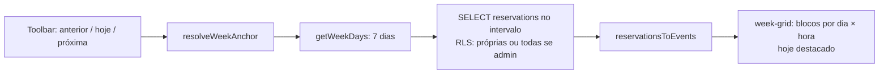

# Spec — Calendário (grade semanal)

> **Rastreabilidade**
>
> - **RF**: [RF-005 — Visualização semanal das reservas](../requirements/RF/RF-005-visualizacao-semanal-das-reservas.md)
> - **Feature**: [F-13 — Grade semanal de reservas (7d × 12h)](../backlog/features/F-13-grade-semanal-de-reservas-7d-x-12h.md)
> - **Código**: `src/app/(app)/calendario/page.tsx` · `week-grid.tsx` · `mini-calendar.tsx` · `calendar-toolbar.tsx` · `calendar-filters.tsx` · `event-card.tsx` · `src/lib/calendar.ts` · `src/lib/calendar-events.ts`
> - **Testes**: `tests/features/US13.1-calendario-semanal.feature`
> - **Mockup**: `docs/mockups/03-calendario.html`

## User Stories

- **US13.1** — Como **usuário**, quero ver as reservas em uma grade semanal (7 dias × 12 horas), para entender de relance a ocupação das salas/equipamentos.

## Critérios de Aceitação

| ID   | Critério                                                                          |
| ---- | --------------------------------------------------------------------------------- |
| CA01 | A grade mostra 7 dias (semana) × 12 faixas horárias.                              |
| CA02 | Cada reserva aparece como bloco posicionado no dia/horário correto.               |
| CA03 | É possível navegar para a semana anterior/seguinte e voltar para "hoje".          |
| CA04 | O dia atual é destacado na grade.                                                 |
| CA05 | O conteúdo respeita a RLS: o professor vê as próprias reservas; o admin vê todas. |

> A matemática de semana (âncora, dias, faixa) é pura em `src/lib/calendar.ts`
> (`resolveWeekAnchor`, `getWeekDays`, `isSameWeek`, `todayUtc`). A conversão de
> reservas em eventos posicionáveis é `reservationsToEvents` em
> `src/lib/calendar-events.ts`. A página é Server Component (`requireProfile()`);
> o filtro/navegação são client islands.

## Cenário BDD

```gherkin
# language: pt
Funcionalidade: Calendário semanal

  Cenário: Visualizar a semana atual com o dia de hoje destacado
    Dado que o usuário abre o calendário
    Então vê uma grade de 7 dias por 12 faixas de horário
    E o dia de hoje aparece destacado

  Cenário: Navegar para a próxima semana
    Dado que o usuário está vendo a semana atual
    Quando avança para a próxima semana
    Então a grade mostra os 7 dias da semana seguinte
    E as reservas correspondentes a esse intervalo
```

## Fluxo


