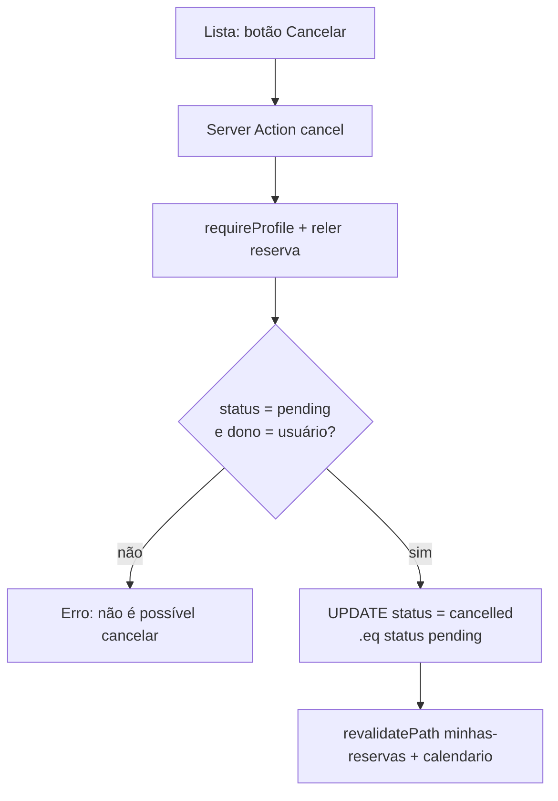

# Spec — Minhas Reservas

> **Rastreabilidade**
>
> - **RF**: [RF-007 — Gestão das próprias reservas](../requirements/RF/RF-007-gestao-das-proprias-reservas.md)
> - **Features**: [F-16 Listagem](../backlog/features/F-16-listagem-de-reservas-pessoais-com-filtros-e-busc.md) · [F-17 Detalhe](../backlog/features/F-17-visualizacao-de-detalhes-de-uma-reserva.md) · [F-18 Edição](../backlog/features/F-18-edicao-de-reserva-pendente.md) · [F-19 Cancelamento](../backlog/features/F-19-cancelamento-de-reserva-pendente.md) · [F-20 Exportação CSV](../backlog/features/F-20-exportacao-de-reservas-para-csv.md)
> - **Código**: `src/app/(app)/minhas-reservas/page.tsx` · `[id]/page.tsx` · `reservations-list.tsx` · `reservation-filters.tsx` · `edit-reservation.tsx` · `cancel-button.tsx` · `actions.ts` · `src/lib/my-reservations.ts`
> - **Testes**: `tests/features/US16.1-...feature` · `US16.2-filtragem-combinada-...feature` · `US17.1-detalhe-da-reserva.feature` · `US18.1-edicao-de-reserva.feature` · `US19.1-cancelamento-de-reserva.feature` · `US20.1-exportacao-de-reservas-em-planilha.feature`
> - **Mockups**: `docs/mockups/06-minhas-reservas.html` · `12-detalhe-reserva.html`
> - **ADRs**: [ADR-006](../planning/adrs/ADR-006-status-concluida-ausente-do-enum-reservation-status.md) (estado "Concluída" derivado)

## User Stories

- **US16.1** — Como **usuário**, quero ver minhas reservas ordenadas (mais recentes primeiro) com filtros, para localizar rapidamente o que procuro.
- **US16.2** — Como **usuário**, quero combinar busca por texto e filtros, para refinar a lista.
- **US17.1** — Como **usuário**, quero ver os detalhes e a linha do tempo de uma reserva, para acompanhar seu andamento.
- **US18.1** — Como **usuário**, quero editar uma reserva **pendente**, para corrigir dados antes da decisão.
- **US19.1** — Como **usuário**, quero cancelar uma reserva **pendente**, para liberar o recurso.
- **US20.1** — Como **usuário**, quero exportar minhas reservas em planilha (CSV), para usar fora do sistema.

## Critérios de Aceitação (consolidados)

| ID   | Critério                                                                               |
| ---- | -------------------------------------------------------------------------------------- |
| CA01 | A lista mostra só as reservas do próprio usuário (RLS).                                |
| CA02 | Ordenação padrão: data decrescente (mais recentes primeiro).                           |
| CA03 | Filtros por status e busca textual combinam entre si.                                  |
| CA04 | Paginação respeita `PAGE_SIZE`.                                                        |
| CA05 | Detalhe exibe dados + histórico (timeline) da reserva.                                 |
| CA06 | Edição e cancelamento só são permitidos enquanto a reserva está **pendente**.          |
| CA07 | Exportação gera CSV com as reservas filtradas.                                         |
| CA08 | O estado "Concluída" é **derivado** (aprovada com horário já passado), não armazenado. |

> Filtro/ordenação/paginação são puros em `src/lib/my-reservations.ts`
> (`applyFilters`, `parseFilters`, `sortByDateDesc`, `PAGE_SIZE`) e testáveis com
> `node:test`. Edição/cancelamento revalidam no servidor que a reserva segue
> `pending` antes de alterar (`minhas-reservas/actions.ts`).

## Cenário BDD

```gherkin
# language: pt
Funcionalidade: Edição de reserva

  Cenário: Editar uma reserva pendente
    Dado que tenho uma reserva pendente
    Quando altero o horário para um período livre e salvo
    Então a reserva é atualizada e continua pendente

  Cenário: Reserva já decidida não pode ser editada
    Dado que tenho uma reserva já aprovada
    Quando tento editá-la
    Então o sistema não permite a edição
```

## Fluxo de cancelamento


