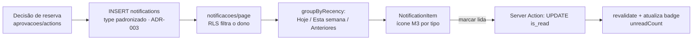

# Spec — Central de Notificações

> **Rastreabilidade**
> - **RF**: [RF-011 — Central de notificações do usuário](../requirements/RF/RF-011-central-de-notificacoes-do-usuario.md)
> - **Features**: [F-34 Listagem](../backlog/features/F-34-listagem-de-notificacoes.md) · [F-35 Marcar individual como lida](../backlog/features/F-35-marcar-notificacao-individual-como-lida.md) · [F-36 Marcar todas como lidas](../backlog/features/F-36-marcar-todas-as-notificacoes-como-lidas.md)
> - **Código**: `src/app/(app)/notificacoes/page.tsx` · `notification-item.tsx` · `notification-toolbar.tsx` · `actions.ts` · `src/lib/notifications.ts`
> - **Testes**: `tests/features/US34.1-lista-de-notificacoes.feature` · `US35.1-notificacao-lida.feature` · `US36.1-todas-as-notificacoes-lidas.feature`
> - **Mockup**: `docs/mockups/10-notificacoes.html`
> - **ADRs**: [ADR-003](../planning/adrs/ADR-003-padronizacao-notification-type-e-emissao-em-server-action.md) (tipo padronizado, emissão em Server Action)

## User Stories

- **US34.1** — Como **usuário**, quero ver minhas notificações agrupadas por recência (Hoje / Esta semana / Anteriores), para acompanhar o que mudou nas minhas reservas.
- **US35.1** — Como **usuário**, quero marcar uma notificação como lida, para limpar o que já vi.
- **US36.1** — Como **usuário**, quero marcar todas como lidas de uma vez, para zerar o contador.

## Critérios de Aceitação

| ID | Critério |
| --- | --- |
| CA01 | A lista mostra só as notificações do próprio usuário (RLS). |
| CA02 | Ordenação: mais recentes primeiro; agrupadas em Hoje / Esta semana / Anteriores. |
| CA03 | O contador de não lidas alimenta o badge da sidebar. |
| CA04 | Marcar individual atualiza o estado e o contador. |
| CA05 | Marcar todas zera o contador de não lidas. |
| CA06 | Cada tipo tem ícone Material Symbol + cor M3 (sem emoji). |

> Agrupamento por recência, ordenação reversa e contagem de não lidas são puros
> em `src/lib/notifications.ts` (`groupByRecency`, `unreadCount`, `filterCounts`,
> `applyFilter`) — testáveis com `node:test`. As notificações são **emitidas na
> Server Action** que decide a reserva (não em trigger) com `type` padronizado —
> ver ADR-003. O contador de não lidas é lido no `(app)/layout.tsx` para o badge.

## Cenário BDD

```gherkin
# language: pt
Funcionalidade: Notificação lida

  Cenário: Marcar uma notificação como lida
    Dado que tenho uma notificação não lida
    Quando a marco como lida
    Então ela deixa de contar como não lida
    E o contador de não lidas diminui em um

  Cenário: Marcar todas como lidas
    Dado que tenho várias notificações não lidas
    Quando marco todas como lidas
    Então o contador de não lidas fica zerado
```

## Fluxo


