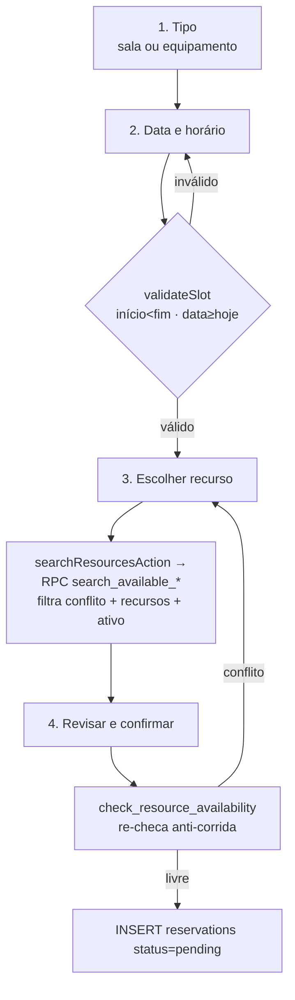
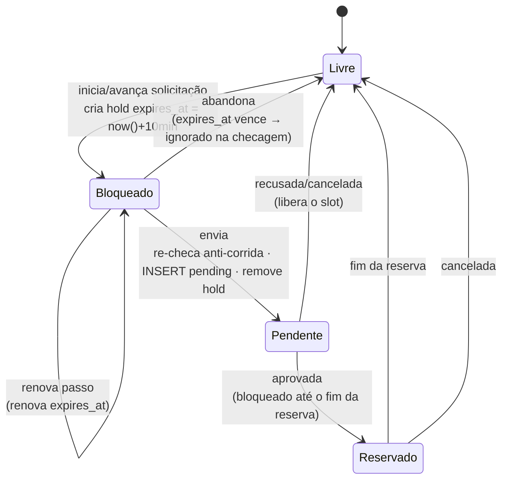

# Spec — Nova Reserva (assistente + detecção de conflito)

> **Rastreabilidade**
>
> - **RF**: [RF-006 — Solicitação de reserva com checagem de disponibilidade](../requirements/RF/RF-006-solicitacao-de-reserva-com-checagem-de-disponibi.md) · [RF-008 — Aprovação e recusa de solicitações](../requirements/RF/RF-008-aprovacao-e-recusa-de-solicitacoes-de-reserva.md) (continuidade do bloqueio na decisão)
> - **RNF**: [RNF-reserva-temporaria](../requirements/RNF/RNF-reserva-temporaria.md)
> - **Features**: [F-14 — Busca de salas com detecção de conflito](../backlog/features/F-14-busca-de-salas-com-deteccao-de-conflito-de-horar.md) · [F-15 — Reserva express (1 clique)](../backlog/features/F-15-reserva-express-com-1-clique-a-partir-do-detalhe.md) · [F-49 — Reserva temporária do recurso durante a solicitação](../backlog/features/F-49-reserva-temporaria-do-recurso-durante-a-solicit.md)
> - **Código**: `src/app/(app)/nova-reserva/page.tsx` · `wizard.tsx` · `stepper.tsx` · `step-type.tsx` · `step-when.tsx` · `step-choose.tsx` · `step-confirm.tsx` · `actions.ts` · `src/app/(app)/aprovacoes/actions.ts` · `src/lib/reservation.ts` · `src/schemas/reservation.ts`
> - **RPCs**: `search_available_rooms`, `search_available_equipment`, `check_resource_availability` (`supabase/migrations/0004_availability_functions.sql`; **estendida** para considerar holds não expirados — ver ADR-009)
> - **Mudança de schema prevista** (reserva temporária): tabela `reservation_holds` + extensão de `check_resource_availability` + limpeza `pg_cron` (TX-12/TX-13 — ver [ADR-009](../planning/adrs/ADR-009-mecanismo-de-reserva-temporaria-hold.md))
> - **Testes**: `tests/features/US14.1-...feature` · `US14.2-deteccao-de-conflito-e-ocupacao.feature` · `US15.1-reserva-rapida.feature`
> - **Mockup**: `docs/mockups/04-nova-reserva.html`

## User Stories

- **US14.1** — Como **professor solicitante**, quero filtrar salas por data, intervalo de horário e recursos, para obter uma lista limpa e ordenada de opções compatíveis.
- **US14.2** — Como **professor solicitante**, quero que a busca remova automaticamente salas com choque (parcial ou total) com reservas aprovadas ou pendentes, para evitar duplicidade de agendamento.
- **US14.3** — Como **professor**, quero ser guiado em quatro passos, para preencher cada parte com clareza e revisar antes de confirmar.
- **US15.1** — Como **professor**, quero reservar em poucos cliques a partir de um recurso disponível, para agilizar quando já sei o que quero.

## Critérios de Aceitação (de F-14)

| ID      | Critério                                                           |
| ------- | ------------------------------------------------------------------ |
| CA01    | Formulário aceita data, início, fim e recursos desejados.          |
| CA02    | Início deve ser anterior ao fim (senão, aviso).                    |
| CA03    | Data deve ser ≥ hoje.                                              |
| CA04    | Resultados não incluem salas com reserva **aprovada** conflitante. |
| CA05    | Reservas **pendentes** também contam como conflito.                |
| CA06    | Reservas canceladas/recusadas **não** geram conflito.              |
| CA07    | Só aparecem salas com **todos** os recursos selecionados.          |
| CA08    | Salas inativas nunca aparecem.                                     |
| CA09    | Sobreposição **parcial** também elimina a sala.                    |
| CA10    | Resultados ordenados por capacidade crescente.                     |
| CA11    | Sem opção: "Nenhuma sala disponível para os critérios".            |
| CA12–14 | Assistente de 4 passos: tipo → data/horário → recurso → revisão.   |

> A validação do slot (CA02/CA03) é pura em `src/lib/reservation.ts`
> (`validateSlot`) e expressa em Zod por `slotSchema` em `src/schemas/reservation.ts`
> (mesma regra). A detecção de conflito (CA04–CA10) **não roda no client**: as
> RPCs `search_available_*` já filtram conflito + recursos + ativo no banco
> (RLS-safe). Na confirmação, `check_resource_availability` re-checa
> anti-corrida. Ver `nova-reserva/actions.ts`.

## Cenários BDD

```gherkin
# language: pt
Funcionalidade: Detecção de conflito e ocupação

  Cenário: Sala com reserva aprovada conflitante é excluída
    Dado que a sala "Lab 1" tem uma reserva aprovada das 14h às 15h
    Quando o professor busca salas para o intervalo das 14h30 às 16h
    Então "Lab 1" não aparece nos resultados

  Cenário: Reserva pendente também gera conflito
    Dado que a sala "Lab 2" tem uma reserva pendente das 14h às 16h
    Quando o professor busca salas para esse mesmo horário
    Então "Lab 2" não aparece nos resultados

  Cenário: Reserva recusada não gera conflito
    Dado que a sala "Lab 3" tem apenas uma reserva recusada das 14h às 16h
    Quando o professor busca salas para esse horário
    Então "Lab 3" aparece nos resultados
```

## Fluxo (assistente de 4 passos)



## Reserva temporária durante a solicitação (F-49)

> **Rastreabilidade**: [RF-006](../requirements/RF/RF-006-solicitacao-de-reserva-com-checagem-de-disponibi.md) · [RF-008](../requirements/RF/RF-008-aprovacao-e-recusa-de-solicitacoes-de-reserva.md) · [RNF-reserva-temporaria](../requirements/RNF/RNF-reserva-temporaria.md) · [ADR-009](../planning/adrs/ADR-009-mecanismo-de-reserva-temporaria-hold.md) · Feature [F-49](../backlog/features/F-49-reserva-temporaria-do-recurso-durante-a-solicit.md)

Ao **iniciar** a montagem da solicitação (e não apenas no envio), o recurso fica temporariamente indisponível aos demais para a mesma data e faixa de horário. Isso fecha a janela de corrida em que dois professores montam a mesma reserva ao mesmo tempo e o conflito só aparecia na confirmação.

O bloqueio é um **hold** com `expires_at` numa tabela dedicada `reservation_holds` — não é uma reserva: não aparece em "minhas reservas" nem dispara aprovação. A função `check_resource_availability` passa a considerar holds **não expirados** (`expires_at > now()`) de **outros** usuários como ocupação (ignorando o do próprio solicitante), além de `pending`/`approved`. Como as buscas reusam essa função, o bloqueio aparece em toda a tela sem mudança nos call-sites.

### User Story

- **US49.1** — Como **professor**, quero que o recurso fique reservado temporariamente para mim enquanto monto a solicitação, para não correr o risco de outra pessoa pegar o mesmo horário antes de eu concluir.

### Critérios de Aceitação (reserva temporária)

| ID   | Critério                                                                                                 |
| ---- | -------------------------------------------------------------------------------------------------------- |
| CA01 | Iniciar a solicitação para um recurso/data/horário o torna indisponível aos demais para esse mesmo slot. |
| CA02 | Dois solicitantes não conseguem garantir o mesmo recurso/data/horário ao mesmo tempo.                    |
| CA03 | O bloqueio vale só para a data e faixa de horário escolhidas; outros horários do recurso seguem livres.  |
| CA04 | Sem conclusão em **10 minutos**, o bloqueio expira e o recurso volta a ficar livre.                      |
| CA05 | Holds já expirados não influenciam a busca de disponibilidade.                                           |
| CA06 | Enquanto a solicitação está pendente de decisão, o recurso permanece indisponível e não expira.          |
| CA07 | Aprovada → o recurso segue indisponível até o fim da reserva.                                            |
| CA08 | Recusada ou cancelada → o recurso é liberado imediatamente.                                              |
| CA09 | O próprio solicitante vê o seu bloqueio em andamento.                                                    |
| CA10 | Os demais apenas veem "indisponível", sem o autor do bloqueio.                                           |

### Cenários BDD (reserva temporária)

```gherkin
# language: pt
Funcionalidade: Reserva temporária do recurso durante a solicitação

  Cenário: Iniciar a solicitação torna o recurso indisponível para outro usuário
    Dado que a professora Ana inicia uma solicitação da sala "Lab 1" para amanhã das 14h às 16h
    Quando o professor Bruno busca salas para amanhã das 14h às 16h
    Então a sala "Lab 1" não aparece como disponível para Bruno

  Cenário: Abandonar a solicitação expira e libera o recurso
    Dado que Ana iniciou a solicitação da sala "Lab 1" para amanhã das 14h às 16h
    E Ana não concluiu a solicitação dentro de 10 minutos
    Quando Bruno busca salas para amanhã das 14h às 16h
    Então a sala "Lab 1" volta a aparecer como disponível para Bruno

  Cenário: Aprovação mantém o recurso indisponível até o fim da reserva
    Dado que a solicitação de Ana para a sala "Lab 1" amanhã das 14h às 16h foi aprovada
    Quando Bruno busca salas para amanhã das 14h às 16h
    Então a sala "Lab 1" segue indisponível para Bruno

  Cenário: Recusa libera o recurso
    Dado que a solicitação de Ana para a sala "Lab 1" amanhã das 14h às 16h foi recusada
    Quando Bruno busca salas para amanhã das 14h às 16h
    Então a sala "Lab 1" volta a aparecer como disponível para Bruno
```

### Ciclo de vida do hold (fluxo)



> A expiração é **autoritativa por filtro** (`expires_at > now()` em `check_resource_availability`): um atraso do job de limpeza nunca trava um recurso. O `pg_cron` (TX-13) é só higiene de linhas mortas. A transferência hold → reserva no envio é atômica na Server Action de confirmação para não deixar janela de corrida (ver `nova-reserva/actions.ts` e ADR-009).
