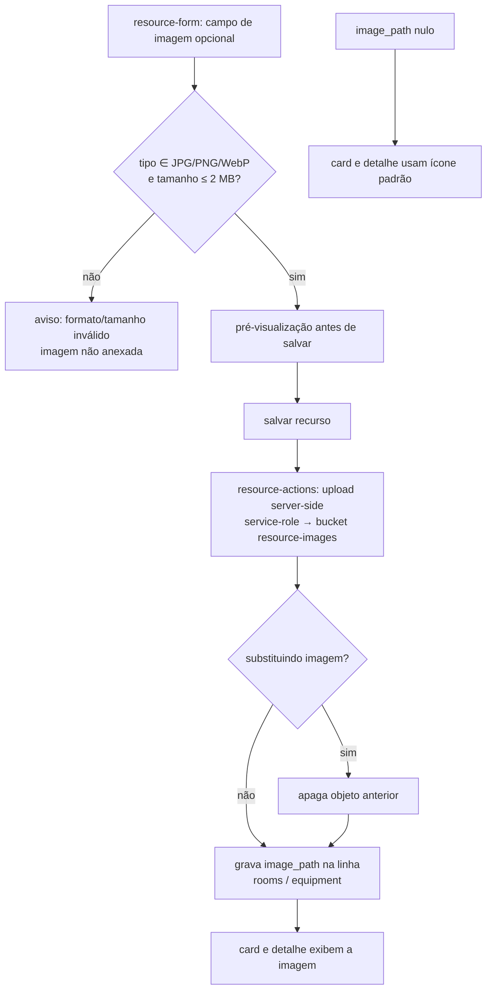

# Spec — Recursos (Salas e Equipamentos)

> **Rastreabilidade**
>
> - **RF**: [RF-009 — Gestão do catálogo de salas](../requirements/RF/RF-009-gestao-do-catalogo-de-salas.md) · [RF-013 — Gestão do catálogo de equipamentos](../requirements/RF/RF-013-gestao-do-catalogo-de-equipamentos.md)
> - **RNF**: [RNF-imagem-de-recurso](../requirements/RNF/RNF-imagem-de-recurso.md)
> - **ADR**: [ADR-008 — Armazenamento de imagens de recursos](../planning/adrs/ADR-008-armazenamento-de-imagens-de-recursos.md)
> - **Features**: [F-24 Cadastro de sala](../backlog/features/F-24-cadastro-de-nova-sala.md) · [F-25 Listagem](../backlog/features/F-25-listagem-de-salas-com-filtros-e-recursos.md) · [F-26 Edição](../backlog/features/F-26-edicao-de-sala.md) · [F-27 Exclusão](../backlog/features/F-27-exclusao-de-sala.md) · [F-43 Cadastro de equipamento](../backlog/features/F-43-cadastro-de-novo-equipamento.md) · [F-44 Listagem](../backlog/features/F-44-listagem-de-equipamentos-com-filtros-e-estado.md) · [F-45 Edição](../backlog/features/F-45-edicao-de-equipamento.md) · [F-46 Exclusão](../backlog/features/F-46-exclusao-de-equipamento.md) · [F-47 Imagem da sala](../backlog/features/F-47-imagem-da-sala.md) · [F-48 Imagem do equipamento](../backlog/features/F-48-imagem-do-equipamento.md)
> - **Código**: `src/app/(app)/salas/page.tsx` · `src/app/(app)/equipamentos/page.tsx` · `src/app/(app)/_resources/` (`resource-page.tsx`, `resource-form.tsx`, `resource-filters.tsx`, `resource-actions.ts`, `resource-card-actions.tsx`, `new-resource-button.tsx`) · `src/lib/resources.ts` · `src/schemas/resource.ts`
> - **Mudança de schema/storage prevista** (imagem): coluna `image_path text null` em `rooms` e `equipment`; bucket `resource-images` no Supabase Storage (TX-09/TX-10/TX-11 — ver ADR-008)
> - **Testes**: `tests/features/US24.1-cadastro-de-sala.feature` · `US25.1-listagem-de-salas.feature` · `US26.1-edicao-de-sala.feature` · `US27.1-exclusao-de-sala.feature`
> - **Mockup**: `docs/mockups/05-gestao-recursos.html`

## User Stories

- **US24.1 / US43** — Como **administrador**, quero cadastrar salas e equipamentos com seus atributos, para disponibilizá-los à reserva.
- **US25.1 / US44** — Como **administrador**, quero listar e filtrar recursos por estado e busca, para gerenciar o catálogo.
- **US26.1 / US45** — Como **administrador**, quero editar um recurso, para manter os dados corretos.
- **US27.1 / US46** — Como **administrador**, quero excluir um recurso, para remover o que não existe mais.

## Critérios de Aceitação

| ID   | Critério                                                                                              |
| ---- | ----------------------------------------------------------------------------------------------------- |
| CA01 | Acesso restrito a administradores (RLS `*_write` exige `is_admin()`).                                 |
| CA02 | Cadastro de sala valida nome, tipo, capacidade (inteiro > 0), bloco e recursos.                       |
| CA03 | Cadastro de equipamento valida nome, tipo, bloco, sala associada e estado.                            |
| CA04 | Estado do recurso: ativo / inativo / manutenção.                                                      |
| CA05 | Listagem filtra por estado e por busca textual, com paginação.                                        |
| CA06 | Recursos inativos não aparecem na busca de nova reserva (ver [nova-reserva](./nova-reserva.md) CA08). |
| CA07 | Salas e equipamentos compartilham a mesma UI parametrizada (`_resources/`).                           |

> A validação canônica vive em `src/lib/resources.ts` (`validateRoomInput`,
> `validateEquipmentInput`, `ROOM_TYPES`) e é expressa em Zod por `roomSchema` /
> `equipmentSchema` em `src/schemas/resource.ts`. As telas `/salas` e
> `/equipamentos` consomem o mesmo `ResourcePage` parametrizado. A escrita é
> protegida no banco pelas policies `rooms_write` / `equipment_write`
> (`using/with check (is_admin())`).

## Cenário BDD

```gherkin
# language: pt
Funcionalidade: Cadastro de sala

  Cenário: Cadastrar uma sala válida
    Dado que sou administrador na gestão de salas
    Quando informo nome, tipo, capacidade maior que zero e estado "ativo"
    E salvo
    Então a sala passa a existir no catálogo

  Cenário: Capacidade inválida é barrada
    Dado que estou cadastrando uma sala
    Quando informo capacidade zero ou negativa
    Então o sistema exibe aviso e não salva
```

## Fluxo (CRUD parametrizado)

```mermaid
flowchart LR
    S[/salas] --> RP[ResourcePage kind=room]
    E[/equipamentos] --> RP2[ResourcePage kind=equipment]
    RP --> F[resource-filters: estado + busca]
    RP2 --> F
    F --> L[listagem paginada<br/>RLS *_select]
    L --> A[resource-actions:<br/>criar / editar / excluir]
    A --> V[safeParse roomSchema/equipmentSchema]
    V --> DB[(rooms / equipment<br/>policy *_write: is_admin)]
```

---

## Imagem do recurso (F-47 / F-48)

> **Rastreabilidade**: [RF-009](../requirements/RF/RF-009-gestao-do-catalogo-de-salas.md) · [RF-013](../requirements/RF/RF-013-gestao-do-catalogo-de-equipamentos.md) · [RNF-imagem-de-recurso](../requirements/RNF/RNF-imagem-de-recurso.md) · [ADR-008](../planning/adrs/ADR-008-armazenamento-de-imagens-de-recursos.md)

### User Stories

- **US47.1** — Como **administrador**, quero anexar, trocar ou remover uma imagem da sala no cadastro e na edição, para que professores reconheçam o espaço no catálogo e na busca.
- **US48.1** — Como **administrador**, quero anexar, trocar ou remover uma imagem do equipamento no cadastro e na edição, para que professores reconheçam o item no catálogo e na busca.

### Critérios de Aceitação (imagem)

| ID    | Critério                                                               |
| ----- | ---------------------------------------------------------------------- |
| IMG01 | Imagem opcional no cadastro e na edição (sala e equipamento).          |
| IMG02 | Formatos aceitos: apenas JPG, PNG ou WebP.                             |
| IMG03 | Tamanho máximo: 2 MB; arquivos maiores são recusados.                  |
| IMG04 | Uma imagem por recurso.                                                |
| IMG05 | Pré-visualização antes de salvar.                                      |
| IMG06 | Substituir/remover a imagem na edição (remover volta ao ícone padrão). |
| IMG07 | Exibição no card (catálogo e busca) e no detalhe.                      |
| IMG08 | Sem imagem (`image_path` nulo) → ícone padrão atual.                   |

> A validação de tipo/tamanho (IMG02/IMG03) é expressa em `roomSchema`/`equipmentSchema`
> (`src/schemas/resource.ts`) e na validação canônica (`src/lib/resources.ts`), no client
> (UX) e no server (garantia). O upload é server-side via service-role ao bucket
> `resource-images`; a linha guarda só o `image_path` (chave do objeto). Ver ADR-008.

### Cenário BDD (imagem)

```gherkin
# language: pt
Funcionalidade: Imagem do recurso

  Cenário: Cadastrar recurso com imagem válida
    Dado que sou administrador no cadastro de um recurso
    Quando escolho uma imagem PNG de 1 MB e vejo a pré-visualização
    E salvo
    Então o recurso passa a exibir a imagem no card e no detalhe

  Cenário: Formato inválido é recusado
    Dado que estou anexando uma imagem
    Quando escolho um arquivo GIF
    Então o sistema avisa que só aceita JPG, PNG ou WebP e não anexa

  Cenário: Recurso sem imagem usa o ícone padrão
    Dado um recurso cadastrado sem imagem
    Quando vejo seu card e detalhe
    Então é exibido o ícone padrão atual
```

### Fluxo (anexo da imagem)


