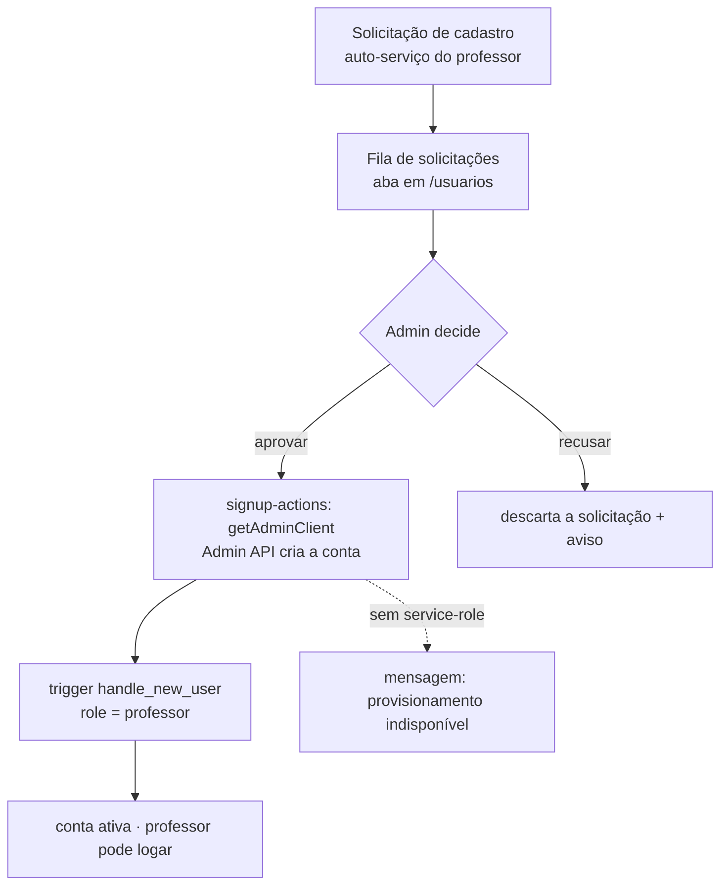

# Spec — Usuários e solicitações de cadastro (admin)

> **Rastreabilidade**
>
> - **RF**: [RF-010 — Gestão de usuários e solicitações de cadastro](../requirements/RF/RF-010-gestao-de-usuarios-e-solicitacoes-de-cadastro.md)
> - **Features**: [F-28 Cadastro](../backlog/features/F-28-cadastro-de-novo-usuario-pelo-admin.md) · [F-29 Listagem](../backlog/features/F-29-listagem-de-usuarios-com-busca-textual.md) · [F-30 Edição](../backlog/features/F-30-edicao-de-usuario.md) · [F-31 Exclusão](../backlog/features/F-31-exclusao-de-usuario.md) · [F-32 Aprovação de cadastro](../backlog/features/F-32-aprovacao-de-solicitacao-de-cadastro.md) · [F-33 Recusa de cadastro](../backlog/features/F-33-recusa-de-solicitacao-de-cadastro.md)
> - **Código**: `src/app/(app)/usuarios/page.tsx` · `user-form.tsx` · `user-filters.tsx` · `user-row-actions.tsx` · `new-user-button.tsx` · `signup-actions.tsx` · `actions.ts` · `src/lib/users.ts` · `src/schemas/user.ts` · `src/lib/supabase/admin.ts`
> - **Testes**: `tests/features/US28.1-cadastro-de-usuario.feature` · `US29.1-lista-de-usuarios.feature` · `US30.1-edicao-de-usuario.feature` · `US31.1-exclusao-de-usuario.feature` · `US32.1-aprovacao-de-cadastro.feature` · `US33.1-recusa-de-cadastro.feature`
> - **Mockups**: `docs/mockups/09-usuarios.html` · `07-cadastro.html`
> - **ADRs**: [ADR-002](../planning/adrs/ADR-002-provisionamento-de-contas-via-service-role.md) (service-role)

## User Stories

- **US28.1** — Como **administrador**, quero cadastrar um usuário, para conceder acesso direto.
- **US29.1** — Como **administrador**, quero listar e buscar usuários por texto, para encontrá-los.
- **US30.1** — Como **administrador**, quero editar um usuário (papel/dados, e-mail imutável), para manter o cadastro correto.
- **US31.1** — Como **administrador**, quero excluir um usuário, para revogar o acesso.
- **US32.1** — Como **administrador**, quero aprovar uma solicitação de cadastro, para liberar o professor.
- **US33.1** — Como **administrador**, quero recusar uma solicitação, para barrar acesso indevido.

## Critérios de Aceitação

| ID   | Critério                                                                                                                              |
| ---- | ------------------------------------------------------------------------------------------------------------------------------------- |
| CA01 | Acesso restrito a administradores.                                                                                                    |
| CA02 | Cadastro valida e-mail, papel (admin/professor) e SIAPE/matrícula (7–12 dígitos).                                                     |
| CA03 | Na edição, a senha só muda se preenchida.                                                                                             |
| CA04 | Na edição, o e-mail é **imutável**.                                                                                                   |
| CA05 | A criação **não** confia em `user_metadata.role`: o trigger força `professor` e a promoção a admin é um UPDATE explícito e auditável. |
| CA06 | Aprovar uma solicitação cria a conta; recusar a descarta com aviso.                                                                   |
| CA07 | Provisionamento indisponível (sem service-role) degrada com mensagem amigável.                                                        |

> Regra de validação canônica em `src/lib/users.ts` (`validateUserInput`,
> `PASSWORD_MIN`), expressa em Zod por `userSchema` em `src/schemas/user.ts`. O
> provisionamento usa o client **service-role** (`src/lib/supabase/admin.ts`,
> `server-only`); a ausência da chave é tratada com `SERVICE_ROLE_MISSING_MESSAGE`
> e a action devolve um resultado amigável (ADR-002).

## Cenário BDD

```gherkin
# language: pt
Funcionalidade: Edição de usuário

  Cenário: Editar um usuário sem trocar a senha
    Dado que sou administrador editando um usuário
    Quando altero o nome e salvo sem preencher a senha
    Então o nome é atualizado e a senha permanece a mesma

  Cenário: E-mail é imutável na edição
    Dado que sou administrador editando um usuário
    Então o campo de e-mail não pode ser alterado
```

## Fluxo de aprovação de cadastro


